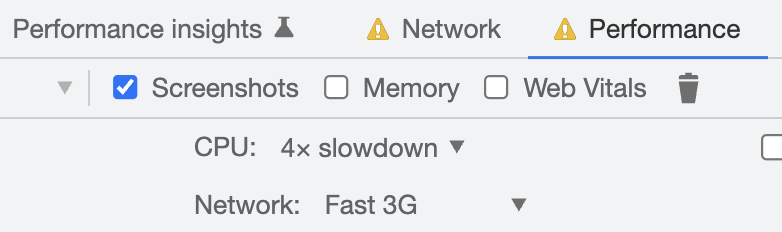

# Why do we need _better_ benchmarking?

Benchmarking is easy to do carelessly, and carelessness can lead to biased, or at worst, **completely wrong** conclusions. It takes only a little extra effort to add a layer of rigour to your benchmarking, which can increase confidence in your results, and help them to be reproducible.

You want to know whether your change (new library, framework, commit) is faster than the baseline that exists. One way to confidently answer this would be to fully implement and run an A/B performance test with real users. In many cases, though, doing this is very difficult or impossible – you need lots of users and a high signal metric, and you may need to fully implement your solution to the standard your users expect before getting any results.

For these reasons, benchmarking is valuable. But there are some simple steps to take to help improve your benchmarks dramatically.

In this post, we'll cover the following:

- How to design your benchmarking setup to avoid bias
- How to analyze benchmark results for significance

# The benchmarking process

Benchmarking should follow this process:

1. Form a strong hypothesis
2. Run the benchmark (test the hypothesis)
3. Analyze data
4. Validate the hypothesis (potentially: new hypothesis)

## 1) Form a strong hypothesis

Your hypothesis is likely related to your change. For example, a benchmarking hypothesis could be "Commit A is faster than Commit B."

However, a stronger hypothesis would be specific about what is causing the difference and precisely what the difference is. A helpful template for a strong hypothesis is "If \_\_, then \_\_, because \_\_". For example,

> **If** we remove unnecessary javascript from the overall bundle, **then** [Total Blocking Time](https://web.dev/tbt/) will go down in Chrome browsers, **because** browsers can spend less time parsing javascript.

This hypothesis is stronger because it not only states what is changing but also what mechanism is causing the change. This claim is helpful, as we can validate our more specific claim – that there is a causal relationship between bundle size and Total Blocking Time.

## 2) Run the benchmark

Designing your benchmark with care is vital in ensuring you collect results that can confirm your hypothesis. Your benchmark should have a baseline (we'll call this control) and a version with your changes (the treatment variation). For each, you will need to design the benchmarking harness and the metrics you wish to collect.

Your hypothesis likely mentions the primary metric to collect. Choose the metric to target ahead of time – if you do not, you open yourself up to [data dredging biases](https://en.wikipedia.org/wiki/Data_dredging) (also known as "p-hacking"), and are likely to find _some_ performance metric that moves in the way you wish.

Design your benchmarking harness to:

- Reduce noise for the metric you have chosen
- Represent real users

This tradeoff can be tricky – some ways of reducing noise signal can make the environment unrealistic (is your dropdown component really going to have millions of entries in the list? Or will it actually be used in isolation?). A stripped-down, realistic version of your production environment is likely to produce the best results. Making this tradeoff requires understanding the real-world environments you designed your benchmark to represent.

For frontend web development, [storybook](https://storybook.js.org/) is a valuable tool for isolating components. There are also [performance tools](https://storybook.js.org/addons/storybook-addon-performance) for storybook that you can use to collect and report metrics directly. Alternatively, consider a complete setup for framework-level changes.

For node development (e.g., Server Side Rendering), a harness like [benchmark.js](https://benchmarkjs.com/) can still be simple and effective. Benchmark.js focuses primarily on ops per second (how many times node can run a function in a second), so it is more likely to be useful for more focused benchmarks.

### Considerations for designing your benchmark

**Diagnostic metrics**: Collect diagnostic metrics to gain confidence in the benchmarking setup. Diagnostic metrics are metrics that are likely to correlate with your primary metric. When choosing these metrics, consider looking for high signal metrics related to the change. For example, if your primary hypothesis is that Total Blocking Time would decrease due to less time spent, consider capturing the [instruction count](https://calendar.perfplanet.com/2019/javascript-component-level-cpu-costs/) during your tests. On the other hand, if you hypothesized that Total Blocking Time would be reduced due to better scheduling, you may instead consider capturing the number of long tasks.

If you see movement in your primary metric, but your diagnostic metrics move in a different direction, there's likely something wrong with your hypothesis or the test setup. Either way, you should investigate this!

**Number of trial runs**: Choosing the number of trials to run opens you to a source of bias. If you stop running the benchmarks when you see a result you like, you're more likely to receive a favorable outcome than if you had set a fixed number of trials. It can, however, be challenging to know how much data you will need before running any tests to provide a strong signal. For this reason, I recommend running some trials first to get a sense of how noisy the data is and then fixing the number of trials when you have a better idea of how many will be needed. You would like your results to fall into a normal distribution, which it eventually will, according to the [central limit theorem](https://en.wikipedia.org/wiki/Central_limit_theorem).

**Cold start vs. warm start**: Benchmarks will often perform very differently after one run vs. subsequent runs. Some tools like [webpagetest](https://docs.webpagetest.org/getting-started/#first-view%3A) offer "first view" and "repeat view" information for precisely this reason. It might be a valuable distinction and worth collecting separately, depending on your hypothesis. Regardless, first runs should nearly always be treated independently.

**Your benchmarking device**: The device you run benchmarks on will significantly impact your results' magnitude and maybe even their direction. Running tests on slower devices is generally an excellent way to increase signal. Tools like [webpagetest](https://webpagetest.org) are ideal for providing real devices in varying locations and network conditions.

Record the type of device you ran the benchmarks on – this will significantly aid the reproducibility and understanding of your results.

Note: Chrome's profiler settings are a _relative_ slowdown measurement – if you use these settings in your benchmarks to slow down your device and increase signal, record the base device you ran your benchmarks on!

**Data collection overhead**: Collecting data can itself have some performance overhead. For example, [the react profiler adds some overhead](https://reactjs.org/docs/profiler.html). If you applied this overhead to both treatment and control, it should equally affect both groups, but it's worth recording and thinking about possible impacts that might vary between groups.

## 3) Analyze the data

Once you've collected your data, you can analyze it to prove or disprove your hypothesis. We would like to know the following:

1. Did your metrics move in the direction you thought they would? What was the difference?
2. Are these results significant?

To answer the first question, we can look at the test data. A simple way of aggregating the data would be to average it, but outliers can skew this substantially. Consider a [truncated mean](https://en.wikipedia.org/wiki/Truncated_mean) to remove outliers, and look at the [distrubtion](https://en.wikipedia.org/wiki/Percentile) too (eg. p50, p95).

A simple way of aggregating this is with a spreadsheet. I'm a big spreadsheet proponent, and they work wonderfully for storing and visualizing benchmarking data. In google sheets, you can calculate each of these aggregations easily:

| Aggregation                  | Formula                                                        |
| ---------------------------- | -------------------------------------------------------------- |
| p50                          | `=percentile(A1:A,0.5)`                                        |
| p95                          | `=percentile(A1:A,0.95)`                                       |
| Capped average (capped at 5) | `=average(map(A1:A, lambda(value, IF(value >= 5, 5, value))))` |

These aggregation methods remove outliers, but it's probably worth trying to debug why they happened in a lab setting. It's possible that whatever is adding noise at the tail end of your distribution of results may also be impacting other parts. For example, network conditions and other activity happening on the device are two possible sources of noise. Ways of eliminating this can include standardizing your machine and removing interfering activity and using a tool like [web page replay](https://chromium.googlesource.com/catapult/+/HEAD/web_page_replay_go/README.md) to control your network conditions during a web benchmarking test.

### Significance

Calculating the _significance_ of your benchmarking result is an often missed step, but one that can strengthen your claims if done correctly.

At the end of your benchmarking, you will have two data sets – the data from your treatment runs and your control runs. Our result is significant if we can say there is a low chance that our result is by chance. Conventionally, we define a low chance to be ~5%, a fair standard to hold most benchmarking results to.

We can use a T-Test on our data to calculate the chance that our data is different only by chance. You can use a T-Test with [google sheets](https://support.google.com/docs/answer/6055837?hl=en). The questions to answer when using this T-Test on your data will be:

1. **One or Two-tailed distribution? (`tails`)** This depends on your hypothesis. If you wish to determine that your treatment is "faster" than the control, but you're not concerned with whether it's possibly slower, use a one-tailed distribution. Otherwise, you can use a two-tailed distribution to consider both possibilities (faster or slower).

[See here for more details](https://stats.oarc.ucla.edu/other/mult-pkg/faq/general/faq-what-are-the-differences-between-one-tailed-and-two-tailed-tests/) on the difference between one and two-tailed tests, along with concrete examples of when to use one and two-tailed tests.

1. **The type of T-Test (`type`)**: You will probably want to use a `two-sample equal variance (homoscedastic) test.` The decision to use an equal or unequal variance test depends on whether your treatment group may have a different type of variance than your control group. You may want to use a `heteroscedastic` test if they are different. The [wikipedia page](https://en.wikipedia.org/wiki/Homoscedasticity_and_heteroscedasticity) has an explanation and some good examples of when you might consider the different types of variance in your treatments.

The result is a p-value: the chance that your test result difference is by chance. The p-value can give you a level of confidence in your test results.

## 4) Validate hypothesis (potentially: new hypothesis)

Congrats on making it this far! If you've:

- Achieved statistically significant results you're confident in, with a p-value <= ~0.05
- Seen diagnostic metrics move in a way that makes sense, given the hypothesis
- Your results line up with your hypothesis

We can pretty confidently say that your hypothesis is correct. If you didn't get this result, it's time for a new hypothesis, and others can repeat this process.

I would also encourage you to publish your data when reporting benchmark results and at least a summary of the device and setup in which you ran the tests. Doing this aids reproducibility and will help push the performance community to understand better how performance works for real users.
