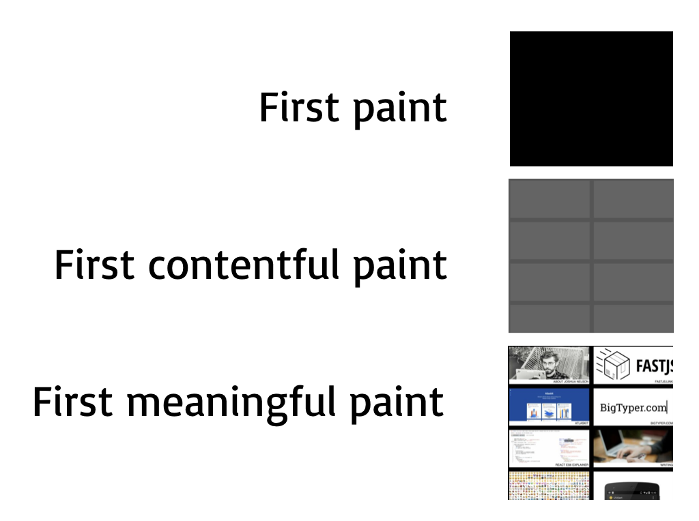
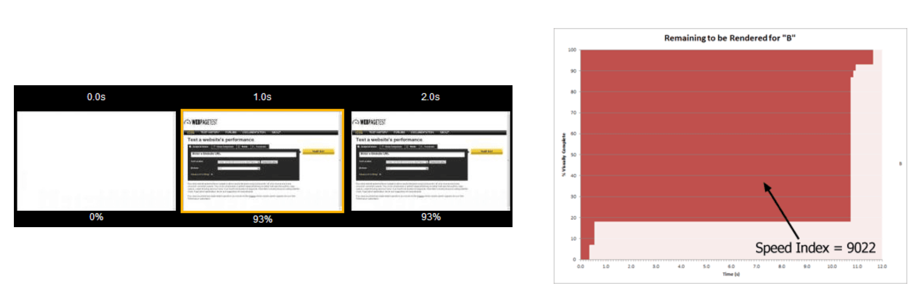

Performance is a problem, and it’s not getting better. The median mobile page load time is 15.6 seconds – this is unacceptable.

We need meaningful measurements that actually capture the real user experience of a page loading for a user.

There are good and bad metrics out there for measuring this. A good metric is one that accurately reflects this user experience, and a bad one does not.

# Bad metrics

We can start with an example of a bad metric. Consider the page loading below:

`youtube: https://www.youtube.com/watch?v=qWKzErmqkZA`

A common way of measuring page loading speed is with the “load” event. However, the point at when the “load” event is fired, the page looks like this:

Which is obviously not the point at which the page has loaded. Relying on this metric is **dangerous**. You’ll focus on the wrong things, changing meaningless numbers. Meanwhile, you’ll neglect real issues – and your users will silently suffer.

# Good metrics

So, that's a bad metric. But what makes a good metric?

## Real user experiences

We’ll say that a metric is good if it *reflects real user experiences*. There are a number of attributes of metrics that would be demonstrate this:

* Measured on a real devices
* Measured on a real user’s network
* Passes a basic litmus test – when is this metric considering an experience good or bad, for my site? Is that in line with what **you** think?

## Is a “continuous” function

In the maths sense, a continuous function means something similar, but we’ll say that a metric is “continuous” if:

> A small improvement in the metric relates to a small improvement in the UX, and a large improvement in the metric relates to a large improvement in the UX.

An example of a metric that would not be “continuous” in this way might be page weight. If you are aggressively code splitting and caching, it might be that an improvement in the page weight relates to no improvement in the UX.

Another metric would be bad if it gave a 100% score if a page loads in <1s and a 0% score if it loads in >=1s – improving load time from 3s to 2s would be a slightly better UX, but would not be rewarded by the metric.

This is a useful property to have in a metric, as it means that the metric cannot be cheated. You can’t quickly render a loading spinner, and have the metric improve. I like to think of the developers who will be looking at this metric as a greedy optimisation algorithm – they will take the shortest path to improving this metric, and ideally, that path will also be the shortest path for improving the overall UX.

## Is “repeatable”

> Never send a human to do a machine’s job – Agent Smith

Some metrics you can get in an easy, automatic way, through monitoring. Some are easier to get with audit tools. However, you must spend the time to automate gathering this data. This is critical for the long time preservation of the metric – humans are less reliable than machines for regular tasks like this, and it’s very useful to have lots of data points. They will be your friend when debugging performance problems, and a long historical backlog of data is precious.

# Metric choices

Let’s have a look at some of the different choices we have, and assess them according to our criteria:

## Page weight

Page weight is a good metric in some ways: it is relatively easy to measure, and [javascript is expensive](https://medium.com/@addyosmani/the-cost-of-javascript-in-2018-7d8950fbb5d4). There is always a user experience cost to delivering javascript, so measuring page weight is a good thing.

However, page weight is a proxy for the real user experience – page weight doesn’t *necessarily* mean that a user’s experience with the page loading was bad. We may be aggressively code splitting or caching, which would mean that this may not fit the criteria set out above.

Ultimately, page weight as a metric will depend on your use case, so think carefully about how the page weight actually impacts the user experience.

[Bundlesize](https://github.com/siddharthkp/bundlesize) is a tool for measuring page weight in an automated way.

## Paint timing

Paint timing is a popular choice for measuring performance.

The three paint timing events in the diagram above reflect different parts of the paint lifecycle.

First paint: anything is painted to the page, e.g.: the page background colour changes from white to black
First contentful paint: a DOM element is rendered to the page, e.g.: a loading spinner is rendered
First meaningful paint: meaningful data is first rendered to the page

First paint and first contentful paint are measurable via the [Paint timing API](https://css-tricks.com/paint-timing-api/), however, first meaningful paint is harder to measure in this way. First meaningful paint is by its nature, meaningful: something that the user thought of as useful to them was given to them. This makes first meaningful paint a good metric, but first paint and first contentful paint may only be meaningful depending on your use case.

### Subsequent meaningful paints

For single page apps, there may be subsequent page loads, other than the "first' meaningful paint. Component timing is an approach that enables us to measure these follow up render times. The [react-component-timing](https://github.com/jpnelson/react-component-timing) library is an attempt to create a React wrapper to automate this – contributions encouraged!

## Speed index

Speed index is a great metric, but can be initially difficult to understand. One way of thinking of it is, we “integrate the % of the page loaded over time” – which probably didn’t help clarify much, so let’s break that down.

We keep track of what percentage of the page has been loaded at some time interval. We score ourselves based on what % of the page we’ve loaded, and how quickly. As an example, a page that loads everything in 5 seconds will get a worse score than a page that loads half of the page at 2.5 seconds, and the other half at 5 seconds.

This is a good metric in the sense that it is naturally extremely “continuous” – it incorporates the concept of “loaded-ness” into a single number. Optimizing for this number will certainly improve real user experiences.

This is a hard metric to use in some other ways though: it is difficult to understand, meaning that it does not convey user empathy very well. It’s unit-less, and so understands a requirement of the metric itself.

It also requires a tool like webpagetest.org to measure it, as we need to know what percentage of the page has loaded at various intervals. It means that we can’t measure it on **real** networks and devices, but we can simulate these conditions.

## ATF (above the fold) render time

Above the fold render time is the time taken until all of the content above the fold of a web page has loaded.

This metric is relatively easy to understand and empathise with, but it does not deal with post initial load well. It’s hard to measure in real browsers, and in reality, your users [probably scroll](http://abovethefold.fyi/).

## Load event

The load event is triggered after DOMContentLoaded, and after javascript downloads.

This is an easy metric to measure and understand, and so is fairly common. However, there are some risks, as in the example perviously – it may not be triggered at a time that is truly meaningful, particularly with asynchronous requests for meaningful data.

## First byte

First byte is easy to measure with the [Navigation API](https://developer.mozilla.org/en-US/docs/Web/API/Navigation_timing_API), and is useful for diagnosing network and backend issues.

However, this first byte may not represent anything actually meaningful to the user, and so cannot be depended upon alone.

## Time to interactive

Time to interactive measures the time taken until the page is ready to respond to user input.

Metrics talked about so far have only concerned themselves with delivering data, but for any application that the user may interact with (most applications!) we need a way of measuring this responsiveness, to understand whether the user would truly consider the experience to be “performant”

Time to interactive is good for doing this, but is less meaningful after the initial page load.

For measuring it, there is a [polyfill available](https://github.com/GoogleChrome/tti-polyfill) that approximates this experience by measuring the time at which the CPU first becomes idle – meaning that the page is ready to respond to user input.

## First input delay

First input delay measures the time it took for the application to respond when the user first interacts with it. This could be a mouse click, touch event, keyboard event, or anything else that the user has initiated.

This metric is particularly interesting since every value represents real user pain. If your first input delay for a particular session is 1000ms, that's a full second someone had to wait before the button did anything!

You need to be aware though, that this metric will naturally have some variance. The first input delay will depend on the user – a patient user might wait a long time before clicking something, but another user might click as soon as a button is rendered. For this reason, it is recommended that the 90th [percentile](https://en.wikipedia.org/wiki/Percentile) is measured, so that you can optimise for reducing those truly painful experiences.

For measuring, there is a [polyfill available](https://github.com/GoogleChromeLabs/first-input-delay)

## DOMContentLoaded

DOMContentLoaded measures the time it takes to parse HTML and download / parse synchronous javascript.

This is basically never what you want. If you're considering using DOMContentLoaded as a checkpoint for your metrics, consider using the "load" event instead.

# The metric starter pack

If you're just getting started and want to start measuring something, I would recommend:

* Time to interactive
* Bundle size
* First input delay
* First meaningful paint (if you can!)

I recommend these as they work pretty well out of the box, there are drop in ways of measuring them, and they represent real user pain in most cases. However, it's worth examining for your use cases, which of these is the best.

# Tools

There are a number of good tools that can be used to measure the above metrics:

1. The chrome devtools, including the audit tab in chrome ("Lighthouse")
2. [Lighthouse CI](https://github.com/ebidel/lighthouse-ci), a repeatable version of the audit tab in chrome
3. [Webpagetest.org](webpagetest.org) is an amazing tool for measuring some of the "hard to measure" metrics listed above – it can produce a video of page load, which it can then analyse to calculate metrics like the speed index.
4. [Sentry](sentry.io), [New Relic](http://newrelic.com) and [Google analytics](https://analytics.google.com) are vital tools for actually tracking real user metrics. Remember the importance of measuring on real devices and real networks – a tool like one of these is essential for doing so.

---

It's important to choose a good metric, that reflects real user networks, devices, and experiences. It's also important to choose a metric that you can automate the collection of.

Now that we have chosen a metric, we need to consider how we will get to this goal, and protect it from the grasp of entropy!

