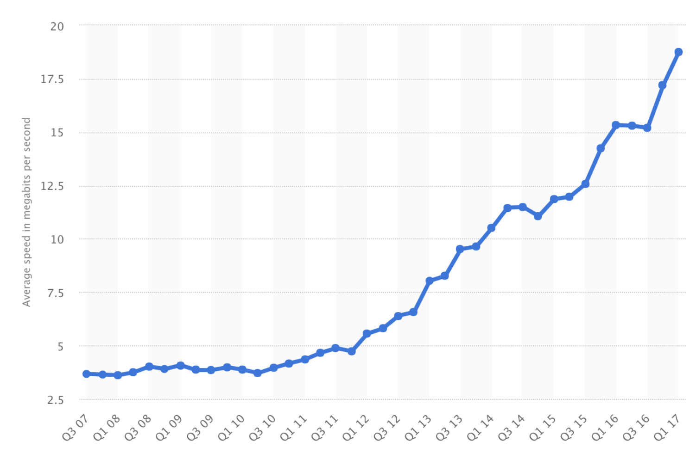
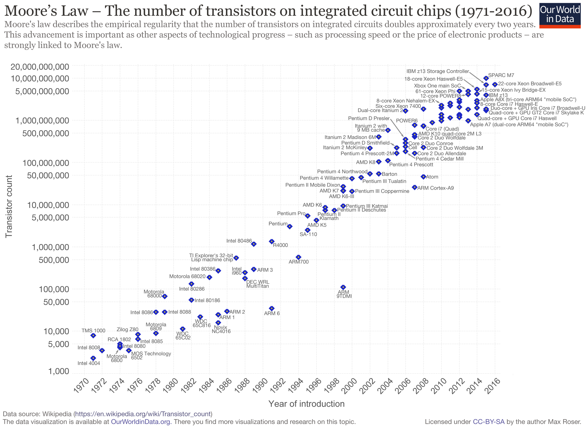
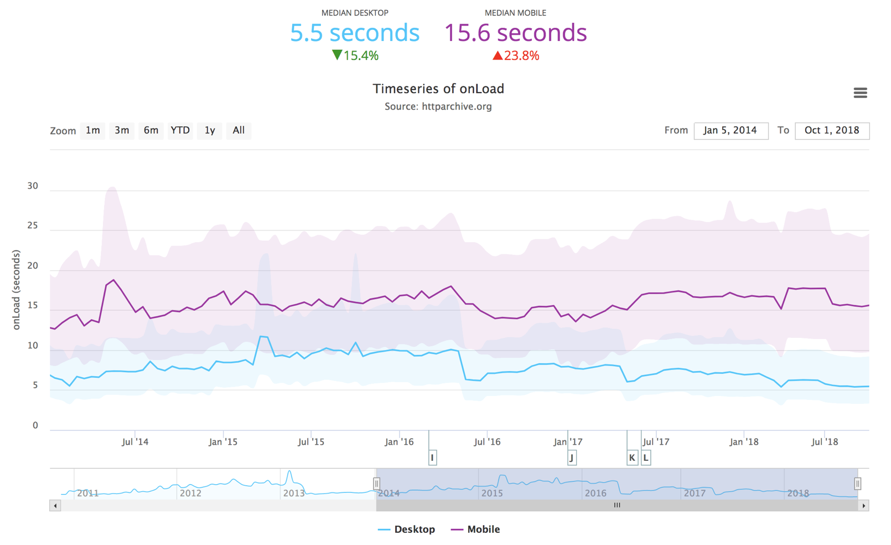
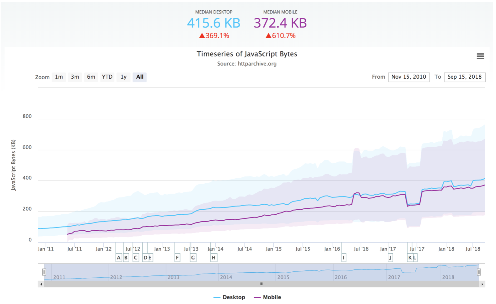

The median page load time for a website on a mobile device is 15.6 seconds.

15.6 seconds.

Think about that.

Imagine if you picked up a newspaper or book, and the letters were invisible, or jumped around, for a full 15.6 seconds before staying still.

First, you'd probably be shocked, books don't normally do that. After that, you'd probably drop it somewhere around the 10 second mark.

This is a totally normal experience for lots of people when trying to use the web on mobile devices. This is a fundamentally broken experience, and it's one that we can fix.

---

The pain of slowly loading websites is one that I've felt acutely over the course of my life. I used to live in a fairly small town, in rural Australia.

Australia isn't exactly famous for blazing fast internet speeds. They did a test, around the time I lived there, in 2009. The Prime Minister said

> If [the opposition] had their way Australians would be left using carrier pigeons for the future rather than accessing an internationally competitive broadband network

So, they tested it. [They flew a carrier pigeon](https://www.itnews.com.au/news/australian-internet-fails-pigeon-test-159232) with a 700 megabyte usb drive from the central west, to Sydney, about 100kms or 60 miles.

The carrier pigeon won, in 1 hour and 5 minutes. They sent a car, which took 2 hours and 10 minutes. And the internet didn't even make it, it dropped out twice.

This is the environment that web pages are loading in, every day. But, it was in 2009, so surely things have gotten better since then, right?

Luckily, they have! Internet speeds have improved over time:

[Reference](https://www.statista.com/statistics/616210/average-internet-connection-speed-in-the-us/
)

And on top of that, CPU speeds have also been increasing every year:

But alas! The web isn't getting faster at all:

[Reference](https://httparchive.org/reports/state-of-javascript?start=earliest&end=latest&view=list)

Why is this? We keep improving our technology, but the internet speeds have stayed roughly the same over the past few years.

A similar thing happens when we add extra lanes to a highway – a phenomenon known as [the "induced demand" effect](https://trrjournalonline.trb.org/doi/abs/10.3141/2653-02?journalCode=trr). Research has found that adding extra lanes to a highway doesn't actually improve traffic much at all – and sometimes makes it worse. A 1% increase in highway capacity can lead to an up to 1.1% increase in demand! The more highway there is, the more people want to use it.

A similar thing has happened with the web. As technology has improved, our appetite for media, new experiences, and ultimately, total bundle size, has grown.

[Reference](https://httparchive.org/reports/state-of-javascript?start=earliest&end=latest&view=list)

So, this problem is not getting better. But for the sake of our users, it needs to.

## The impact of performance

There are three major areas that this has an impact: It affects business goals, user happiness, and ultimately, the world.

### Business goals

Performance directly equates to business goals, and money $$$.

Research conducted by Microsoft found that a one second delay in Bing resulted in a 2.8% drop in revenue. Two seconds of delay resulted in a 4.3% drop.

Walmart found that a one second improvement in load time resulted in a 2% increase in conversions, and every 100ms resulted in up to a 1% increase in conversions.

Google found that publishers whose mobile sites load in 5 seconds earn *double* from mobile ad revenue than sites loading in 19 seconds.

There are [many, similar results](https://wpostats.com/tags/revenue/) from all sorts of sites.

So, time invested in fixing performance directly leads to money. It's already worth investing in performance, just based on this alone.

### User happiness

[Human Computer Interaction research](https://www.nngroup.com/articles/response-times-3-important-limits/) shows that from the users perspective, there are three general categories of tasks:

* Tasks in <= 0.1s are **"instant"** tasks. The user feels as though the system is reacting immediately to their input
* Tasks in <= 1s are **flow** tasks. The user is able to maintain a sense of flow as they are navigating through their tasks. They will notice delay, but it will not break concentration
* Tasks in > 10s result in a **task switch**

However, along that spectrum, from 1 second to 10 seconds, users are getting progressively more and more frustrated. The moment at which the user is switching a task, the user is certainly frustrated – impacting how they feel about your product, and making them unhappy.

### The world

A version of youtube was created, called "[Youtube feather](https://wpostats.com/2015/11/11/youtube-feather.html)". This version of youtube was 90% lighter in terms of page weight, and contained just the bare minimum for youtube to load. The creators wanted to see if this would improve average load times for that version, so they opted in a small percentage of traffic.

Strangely, they found that the average load time actually went up!

Upon investigation, they found an *increase* in traffic from Southeast Asia, South America, Africa and Sibera – areas with traditionally poor internet connectivity. These were actually new users – users who previously would not have been able to use Youtube at all, due to prohibitively slow loading times!

## What next?

So, performance is a problem, and it's one worth fixing. However, it's pretty likely if you're reading this that you **already think** that performance is an issue.

Then, why haven't we fixed it?

There are a couple of common responses I've heard:

1. The "give up": "It's such a hard problem, we can't fix it"
2. The "denial": "It's ok, our users have fast internet and cpu's, right?"
3. The "loop": "Oh god you're right, let's fix it" -> "we fixed it!" -> "Oh god it's terrible again"

So, performance is doomed to be bad until the inevitable heat death of the universe. Ever expanding entropy will claim all. Chaos reigns supreme. We can’t control it, performance will always regress.

Or, we try.

Meaningful performance metrics can save you.

We need a *meaningful* way of measuring performance, and to make a commitment that we'll hold to, once and for all.