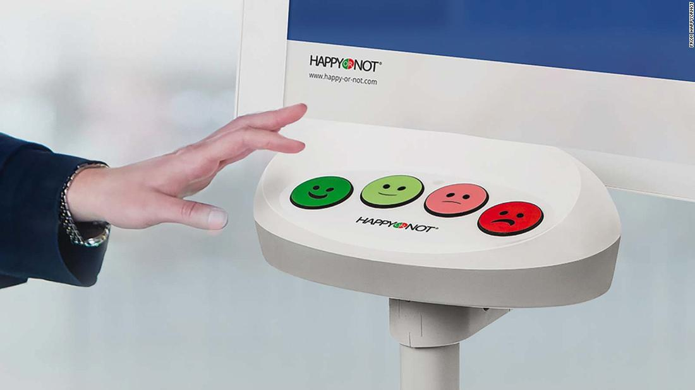
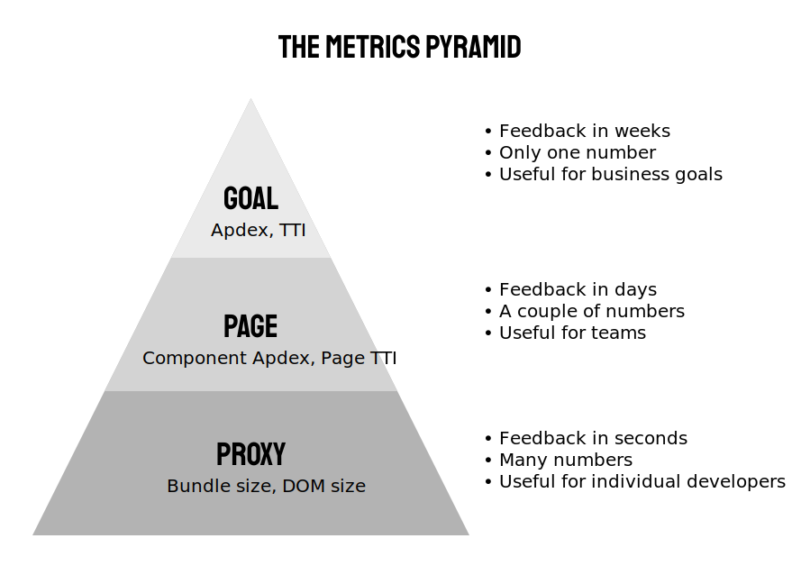

I've applied for my driver's license twice now – once at a place called the **RMS**, and another time at a place called the **DMV**. These experiences were *very* different in a lot of ways. Going to the DMV was a nightmarish experience, wrought with frustration and bureaucracy, and a fair amount of confusion. In comparison, my experience at the RMS was quick, efficient, and while not exactly thrilling, a fine experience overall.

One of the other differences between these two places is on your way out of the RMS, you are presented with a little kiosk like the one below with some faces on it. You are asked to rate your experience, and describe how you felt about it by pressing one of the buttons. This lets the service measure how happy people are, and adjust when this is off.

This is what Apdex is trying to do for websites. Sometimes we explicitly ask what users think (Through CSAT, NPS, and other questions), and sometimes we calculate it from other things, but what we really want to measure is, "How happy are our users with how fast our site is?".

This is done by taking the load time of a website, and assuming that everyone with a page load of < `t` seconds is "happy", people who load the page in < `4*t` seconds is "neutral" and anyone who loads the page in > `4*t` seconds is frustrated.

On the surface, Apdex sounds like an all-in-one solution to measuring page load performance in a consistent way. The danger is, we aren't explicitly asking our users whether they are happy, so we need to make sure we're inferring it in the correct way. 

# Apdex numbers not comparable

Apdex produces a unitless number between 0 and 1, which is meant to correlate with how happy users are with the loading experience of a website. There's a danger here in assuming that you can compare these numbers with each other. There are two variables that need to be the same before you can do this: the value you choose for `t`, and the event at which you consider a page "loaded".

Being consistent with your choice for `t` is a good idea if you're working on a large product, or measuring different parts of the same experience. `t=1` is a good choice, considering that load times of `< 1 second` [allow a user to maintain flow](/the-case-for-performance/#user-happiness).

The other variable is your load event. There are [many choices for this number](/choosing-a-metric/#metric-choices), but you should pick something that reflects the user's actual experience, since we're only inferring whether the user was happy.

If these two variables are the same, you will be able to compare Apdex numbers, which is useful if you are interested in the relative performance (eg. you and a competitor, or two different parts of the same overall experience). However, if you are using a different `t` value or a different load event, these numbers are not directly comparable.

# Apdex doesn't measure SPA interactions

Apdex was created in a time before single page apps were an industry standard approach for creating sites. Apdex is a good way of measuring an initial page load, but single page apps need a way to measure the time it takes to transition between pages.

If you ignore those page transitions when calculating Apdex, you're ignoring a big part of the user's experience. If you include them, your Apdex number will improve dramatically, as generally these transitions are much faster than an initial page load, but your metrics won't weight the initial page load as much.

There are a couple of ways to work around this – you might report two Apdex numbers, one for the initial load, and one for transitions. However, you then lose one of the benefits of Apdex, which is a single, unified number. An alternative for this is to use a single combined number, weighting the relative importance of the initial load Apdex and the transition Apdex. You might specify `Single Page Apdex = 0.8 * Initial Load Apdex + 0.2 * Transition Apdex`.

# Apdex is not a precise metric

The usefulness of a metric comes from being able to monitor changes, and see what their impact is to something that you care about (like performance). However, the feedback loop for a number like Apdex can be long – when making a change locally, or in some staging environment, it's hard to know if you're making any progress until this change is released to end users.

For this reason, it's important to have more precise metrics that are monitored. You might monitor the load time of a specific component on a page, or a particular milestone on that page load (time for the header to render, or time for data to be rendered on the screen). This allows individual developers to see the impact of their changes, and know they are moving things in the right direction.

I think about this as a "metrics pyramid", similar to the [testing pyramid](https://martinfowler.com/bliki/TestPyramid.html).

**Goal metrics** are metrics like Apdex or average time to interactive, which act as an all-encompassing, global goal measurement of "performance" for an application. There should be only one of these, and it should very closely tie to the end user's experience, as this is what all effort will be focused on shifting.

**Page metrics** are the next level down, and there may be more of these. These measure individual pieces of an experience, such as "time to load just the home page", or "how long it takes for the navigation to appear". These goals can be split up, so that teams of people or individuals can focus on smaller sub-goals.

**Proxy metrics** may be much more common, and they don't directly relate to a real user experience. Things like the bundle size, or the number of DOM elements can be useful to measure as they provide immediate feedback to a developer, but they are only tangentially related to both *page metrics* and the overall *goal metrics*.

It's important most of all that individual developers can see how each of these metrics are calculated, and feed into each other. This is important so that everyone can focus on improving the most important parts of the overall experience – even if on a given day, the goal metric number doesn't shift, progress can be measured and checked.

# Have a "meta metric"

Even after doing this, and putting your best efforts into coming up with a good system and target for metrics, you might get it wrong. For this reason, it's important to have a "meta metric" – a way of knowing whether your metrics are good. For this, nothing beats just talking to users. Do they think that the site is slow? Which parts do they find frustrating?

At a small scale, this can be as simple as asking people regularly, and at a large scale, in-product CSAT and NPS responses are a good way to know if users are perceiving a problem. If your Apdex is "good", but users are complaining about the site's performance, it's time to revisit how you are using Apdex.

Apdex is a useful tool, but by itself, is not an all encompassing solution for measuring performance. It does some things well, like providing a single goal, and it represents a distribution of users, but it has its drawbacks, and may not be the best solution for every use case. A simple, understandable, system of metrics is useful for measuring large systems, and thinking carefully about what you're measuring and setting as a goal is an important step in making a better experience for your users.